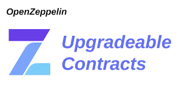
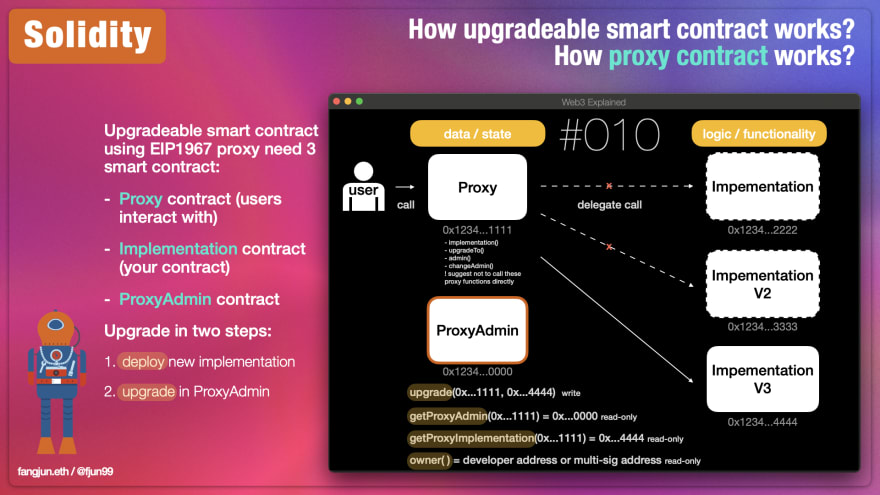

# Upgraded Box

## Descripción:

Este mini-proyecto está basado en siguiente artículo: https://dev.to/yakult/tutorial-write-upgradeable-smart-contract-proxy-contract-with-openzeppelin-1916.

El propósito consiste en aprender como hacer upgrades de contratos de Solidity con la ayuda de la librería @openzeppelin/hardhat-upgrades.

El proceso de construcción de este proyecto está dividido en 7 tareas divididas a su vez en varias subtareas.

## Funcionamiento de un smart contract actualizable:

Para ilustrar como se estructuran esta clase de contratos vamos a echar mano de una imágen del artículo que hemos mencionado en la descripción.

Un smart contract actualizable consta de tres contratos a su vez:

- Contrato proxy (proxy contract): Es al que apuntará cualquier cliente que quiere interactuar con el contrato. Su address siempre es la misma en las sucesivas actualizaciones. Es también el responsable de conservar la información en memoria.

- Contrato proxy de administración (proxy admin contract): La address de este contrato, al igual que la del anterior, tampoco variará entre las sucesivas actualizaciones. Su función en este ejercicio será la de proporcionarnos una interfaz con la que poder actuar para hacer ciertas actulizaciones en el contrato proxy por medio de Etherscan. Podríamos decir que este contrato proxy admin actúa como el owner del proxy.

- Contrato de implementación (implementation contract): Este contrato es el que contiene la lógica. Viene a ser el smart contract que el desarrollador programa. Cada implementación o actualización tiene su propia address es decir, así como los contratos anteriores se mantienen este va cambiando en cada implementación.

Cuando desplegamos por primera vez un smart contract actualizable lo que en realidad desplegamos son estos tres contratos que acabamos de mencinar. Es en esta labor en la que los pluggins de OpenZeppelin Upgrades para Hardhat (también están disponibles para Truffle) nos resultarán de gran ayuda.

Como se veía en el esquema anterior, el contrato de admin y el proxy están vinculados siendo el proxy, a su vez, la puerta de entrada al contrato de implementación.

## Tarea 1: Generar el entorno de desarrollo de Hardhat:

### Tarea 1.1: Crear el esqueleto de Hardhat:

Nota: si estamos trabajando con la versión 18 de NodeJS y nos aparece el error < Error HH604: Error running JSON-RPC server: error:0308010C:digital envelope routines::unsupported > debemos ejecutar en la terminal el comando: export NODE_OPTIONS=--openssl-legacy-provider.

- Lo primero que haremos será crear un directorio (donde mejor nos venga) y acceder a su interior mediante la terminal de comandos.

- Una vez dentro del directorio inicializaremos un proyecto con el comando < npm init >.

- Una vez se nos haya creado el package.json estaremos en disposición de instalar Hardhat ejecutando < npm i hardhat >.

- Lo siguiente será generar el entorno de desarrollo de Hardhat mediante el comando < npx hardhat node >. Se nos irán ofreciendo varias opciones. es importante para seguir este tutorial de una manera sencilla que, cuando se nos pregunte entre Javascript y Typescript, elegir Typescript.

### Tarea 2.2: Arrancar un nodo de Hardhat:

- Si volvemos a ejecutar el comando < npx hardhat node > se nos arrancará un node de Hardhat y, en la terminal, se nos mostrarán una serie de pares de claves que se nos proporcionarán por defecto.

Comandos de Hardhat:

npx hardhat node

npx hardhat run scripts/1.deploy_box.ts --network localhost

npx hardhat run scripts/2.upgradeV2.ts --network localhost

npx hardhat run scripts/3.upgradeV3.ts --network localhost

npx hardhat run scripts/4.prepareV4.ts --network localhost

npx hardhat console --network localhost
