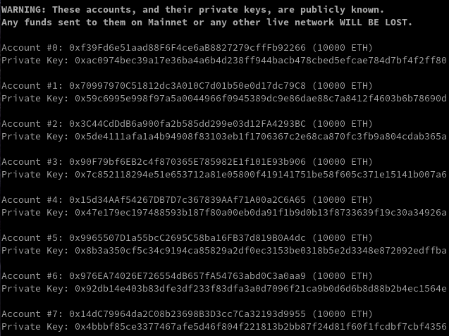
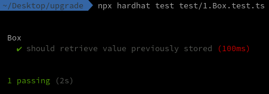
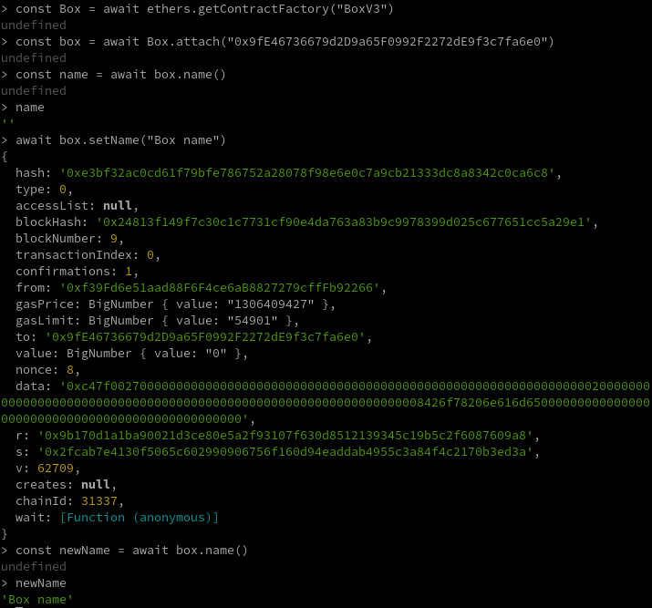
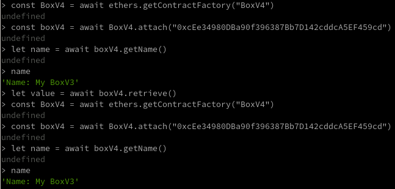

# Upgraded Box


## Descripción:

Este mini-proyecto está basado en siguiente artículo: https://dev.to/yakult/tutorial-write-upgradeable-smart-contract-proxy-contract-with-openzeppelin-1916.

El propósito consiste en aprender como hacer upgrades de contratos de Solidity con la ayuda de la librería @openzeppelin/hardhat-upgrades.

El proceso de construcción de este proyecto está dividido en varias tareas divididas a su vez en varias subtareas.

## Funcionamiento de un smart contract actualizable:

Para ilustrar como se estructuran esta clase de contratos vamos a echar mano de una imágen del artículo que hemos mencionado en la descripción.


Un smart contract actualizable consta de tres contratos a su vez:

- Contrato proxy (proxy contract): Es al que apuntará cualquier cliente que quiere interactuar con el contrato. Su address siempre es la misma en las sucesivas actualizaciones. Es también el responsable de conservar la información en memoria.

- Contrato proxy de administración (proxy admin contract): La address de este contrato, al igual que la del anterior, tampoco variará entre las sucesivas actualizaciones. Su función en este ejercicio será la de proporcionarnos una interfaz con la que poder actuar para hacer ciertas actulizaciones en el contrato proxy por medio de Etherscan. Podríamos decir que este contrato proxy admin actúa como el owner del proxy.

- Contrato de implementación (implementation contract): Este contrato es el que contiene la lógica. Viene a ser el smart contract que el desarrollador programa. Cada implementación o actualización tiene su propia address es decir, así como los contratos anteriores se mantienen este va cambiando en cada implementación.

Cuando desplegamos por primera vez un smart contract actualizable lo que en realidad desplegamos son estos tres contratos que acabamos de mencinar. Es en esta labor en la que los pluggins de OpenZeppelin Upgrades para Hardhat (también están disponibles para Truffle) nos resultarán de gran ayuda.

Como se veía en el esquema anterior, el contrato de admin y el proxy están vinculados siendo el proxy, a su vez, la puerta de entrada al contrato de implementación.

## Tarea 1: Generar el entorno de desarrollo de Hardhat (si ya tienes experiencia trabajando con Hardhat puedes saltar esta primera tarea).

### Tarea 1.1: Crear el esqueleto de Hardhat.

Nota: si estamos trabajando con la versión 18 de NodeJS y nos aparece el error < Error HH604: Error running JSON-RPC server: error:0308010C:digital envelope routines::unsupported > debemos ejecutar en la terminal el comando: export NODE_OPTIONS=--openssl-legacy-provider.

- Lo primero que haremos será crear un directorio (donde mejor nos venga) y acceder a su interior mediante la terminal de comandos.

- Una vez dentro del directorio inicializaremos un proyecto con el comando < npm init >.

- Una vez se nos haya creado el package.json estaremos en disposición de instalar Hardhat ejecutando < npm i hardhat >.

- Lo siguiente será generar el entorno de desarrollo de Hardhat mediante el comando < npx hardhat node >. Se nos irán ofreciendo varias opciones. es importante para seguir este tutorial de una manera sencilla que, cuando se nos pregunte entre Javascript y Typescript, elegir Typescript.

### Tarea 1.2: Arrancar un nodo de Hardhat.

Si volvemos a ejecutar el comando < npx hardhat node > se nos arrancará un nodo de Hardhat y, en la terminal, se nos mostrarán una serie de pares de claves que se nos proporcionarán por defecto.



### Tarea 1.3: Cambiar el contrato que viene por defecto por otro más simple.

En el esqueleto que nos ha creado Hardhat aparece un contrato Lock.sol creado por defecto. Vamos a cambiar este contrato para que simplificarlo y que se parezca lo máximo posible al que vamos a utilizar posteriormente para el ejercicio.

Vamos a cambiar el nombre del contrato contrato por Box.sol y el código va a ser el siguiente:

```js
// contracts/Box.sol
// SPDX-License-Identifier: MIT
pragma solidity ^0.8.0;

contract Box {
    uint256 private value;

    constructor(uint256 newValue) {
        value = newValue;
    }

    function retrieve() public view returns (uint256) {
        return value;
    }
}
```

### Tarea 1.4: Compilar el contrato.

Para compilar nuestro contrato utilizaremos el comando < npx hardhat compile >.

Se nos generará una carpeta llamada artifacts que contiene a su vez un directorio llamado contracts dentro del cual se encuentra el .json del contrato.

```js
{
  "_format": "hh-sol-artifact-1",
  "contractName": "Box",
  "sourceName": "contracts/Box.sol",
  "abi": [
    {
      "inputs": [
        {
          "internalType": "uint256",
          "name": "newValue",
          "type": "uint256"
        }
      ],
      "stateMutability": "nonpayable",
      "type": "constructor"
    },
    {
      "anonymous": false,
      "inputs": [
        {
          "indexed": false,
          "internalType": "uint256",
          "name": "newValue",
          "type": "uint256"
        }
      ],
      "name": "ValueChanged",
      "type": "event"
    },
    {
      "inputs": [],
      "name": "retrieve",
      "outputs": [
        {
          "internalType": "uint256",
          "name": "",
          "type": "uint256"
        }
      ],
      "stateMutability": "view",
      "type": "function"
    }
  ],
  "bytecode": "0x608060405234801561001057600080fd5b5060405161016b38038061016b8339818101604052810190610032919061007a565b80600081905550506100a7565b600080fd5b6000819050919050565b61005781610044565b811461006257600080fd5b50565b6000815190506100748161004e565b92915050565b6000602082840312156100905761008f61003f565b5b600061009e84828501610065565b91505092915050565b60b6806100b56000396000f3fe6080604052348015600f57600080fd5b506004361060285760003560e01c80632e64cec114602d575b600080fd5b60336047565b604051603e91906067565b60405180910390f35b60008054905090565b6000819050919050565b6061816050565b82525050565b6000602082019050607a6000830184605a565b9291505056fea26469706673582212203ab95319930035d477a42d36ca635ae4ffe6ec17482f4501dd3a6f85686e826e64736f6c63430008090033",
  "deployedBytecode": "0x6080604052348015600f57600080fd5b506004361060285760003560e01c80632e64cec114602d575b600080fd5b60336047565b604051603e91906067565b60405180910390f35b60008054905090565b6000819050919050565b6061816050565b82525050565b6000602082019050607a6000830184605a565b9291505056fea26469706673582212203ab95319930035d477a42d36ca635ae4ffe6ec17482f4501dd3a6f85686e826e64736f6c63430008090033",
  "linkReferences": {},
  "deployedLinkReferences": {}
}
```

### Tarea 1.4: Desplegar el contrato en nuestro nodo local.

El despliegue lo realizaremos mediante la ejecución del archivo deploy.ts que se encuentra en la carpeta scripts.

El código que debe contener es el siguiente:

```js
import { ethers } from "hardhat";

async function main() {
  const Box = await ethers.getContractFactory("Box");
  const box = await Box.deploy(5);

  await box.deployed();

  console.log(`Contract deployed to the following address ${box.address}`);
}

main().catch((error) => {
  console.error(error);
  process.exitCode = 1;
});
```

Este script hace lo siguiente:

- Importamos una función ethers (en este caso la implementación de hardhat).

- Declaramos una función main. Dentro de main está la llamada al contrato y el despliegue del mismo pasándole el parámetro que requería el constructor (recordemos que era un uint256 para darle un valor a la propiedad value).

- Por último viene el llamado a la función main. Es aquí cuando se despliega el contrato.

Una vez configurado el archivo podemos ejecutar el despliegue con el comando < npx hardhat run scripts/deploy.ts --network localhost >

Si el proceso se ha producido correctamente veremos en la terminal en la que está arrancado en nodo la siguiente información:


Al mismo tiempo, tiene que aparecer en la terminal en la que hemos ejecutado el comando de despliegue el siguiente mensaje:


### Tarea 1.5: Comprobar en la consola de Hardhat el correcto funcionamiento del contrato.

En otra terminal ejecutaremos en comando < npx hardhat console --network localhost >

Esto nos abre la consola de Hardhat.

Lo siguiente que haremos será llamar al contrato, instanciarlo, llamar nuestro método retrieve para guardar el valor que devuelve en una constante y, por último, imprimir el valor de la constante por consola.

La secuencia completa quedaría de la siguiente forma:

```js
> const Box = await ethers.getContractFactory("Box")
undefined
> const box = await Box.attach("0x5FbDB2315678afecb367f032d93F642f64180aa3")
undefined
> const value = await box.retrieve()
undefined
> value
BigNumber { value: "5" }
```

## Tarea 2: Implementar el que será nuestro contrato acualizable (upgradeable smart contract).

### Tarea 2.1: Instalar openzeppelin/hardhat-upgrades.

Para ello deberemos ejecutar el comando npm i @openzeppelin/hardhat-upgrades.

### Tarea 2.2: Implementar hardhat-upgrades en nuestra configuración de Hardhat.

Lo importaremos en hardhat.config.ts mediante < import '@openzeppelin/hardhat-upgrades'; >

### Tarea 2.3: Reemplazar el contenido del contrato Box.sol por el de un contrato acutalizable.

Sustituiremos el código de nuestro contrato por el que vemos a continuación:

```js
// contracts/Box.sol
// SPDX-License-Identifier: MIT
pragma solidity ^0.8.0;

contract Box {
    uint256 private value;

    // Emitted when the stored value changes
    event ValueChanged(uint256 newValue);

    // Stores a new value in the contract
    function store(uint256 newValue) public {
        value = newValue;
        emit ValueChanged(newValue);
    }

    // Reads the last stored value
    function retrieve() public view returns (uint256) {
        return value;
    }
}
```

La principal diferencia entre este código y el anterior es que, en este caso, ya no tenemos contructor. Esto se debe a que los contratos proxy carecen del constructor el cual es reemplazado por una función inicializadora a la que se llamará en el script de deploy. En este caso, la función inicializadora será store y ella será la encargada de asignarle a la variable value ev valor correspondiente en el momento del despliegue del contrato.

Personalmente, recomiendo borrar las carpetas cache y artifacts y volver a ejecutar el comando < npx hardhat compile > para evitar problemas.

### Tarea 2.4 Testear el contrato.

Vamos a crear un test unitario para nuestro contrato. El código irá en la carpera test de nuestro proyecto y es el siguiente:

```js
// test/1.Box.test.ts
import { expect } from "chai";
import { ethers } from "hardhat";
import { Contract, BigNumber } from "ethers";

describe("Box", function () {
  let box: Contract;

  beforeEach(async function () {
    const Box = await ethers.getContractFactory("Box");
    box = await Box.deploy();
    await box.deployed();
  });

  it("should retrieve value previously stored", async function () {
    await box.store(42);
    expect(await box.retrieve()).to.equal(BigNumber.from("42"));

    await box.store(100);
    expect(await box.retrieve()).to.equal(BigNumber.from("100"));
  });
});
```

Aclarar que este es un test unitario común. En el no estamos tratando al contrato como un proxy.

Para llevar a cabo el test ejecutarmos el comando < npx hardhat test test/1.Box.test.ts > obteniendo como resultado la siguiente respuesta:



### Tarea 2.5: Hacer un test del contrato desplegado como proxy.

Vamos a crear un archivo llamado 2.BoxProxy.test.ts en la carpeta test.

En el archivo que acabamos de crear pegaremos el siguiente código:

```js
// test/2.BoxProxy.test.ts
import { expect } from "chai";
import { ethers, upgrades } from "hardhat";
import { Contract, BigNumber } from "ethers";

describe("Box (proxy)", function () {
  let box: Contract;

  beforeEach(async function () {
    const Box = await ethers.getContractFactory("Box");
    //initialize with 42
    box = await upgrades.deployProxy(Box, [42], { initializer: "store" });
  });

  it("should retrieve value previously stored", async function () {
    // console.log(box.address," box(proxy)")
    // console.log(await upgrades.erc1967.getImplementationAddress(box.address)," getImplementationAddress")
    // console.log(await upgrades.erc1967.getAdminAddress(box.address), " getAdminAddress")

    expect(await box.retrieve()).to.equal(BigNumber.from("42"));

    await box.store(100);
    expect(await box.retrieve()).to.equal(BigNumber.from("100"));
  });
});
```

Para ejecutar el test utilizaremos el comando < npx hardhat test test/2.BoxProxy.test.ts >.

El test debe devolvernos el siguiente resultado:


### Tarea 2.6: Crear script de despliegue.

Dentro de la carpeta scripts crearemos un archivo llamado 1.deploy_box.ts y en el pegaremos el siguiente código:

```js
// scripts/1.deploy_box.ts
import { ethers } from "hardhat";
import { upgrades } from "hardhat";

async function main() {
  const Box = await ethers.getContractFactory("Box");
  console.log("Deploying Box...");
  const box = await upgrades.deployProxy(Box, [42], { initializer: "store" });

  console.log(box.address, " box(proxy) address");
  console.log(
    await upgrades.erc1967.getImplementationAddress(box.address),
    " getImplementationAddress"
  );
  console.log(
    await upgrades.erc1967.getAdminAddress(box.address),
    " getAdminAddress"
  );
}

main().catch((error) => {
  console.error(error);
  process.exitCode = 1;
});
```

Un detalle a tener en cuenta es que, a diferencia de lo que hicimos en el anterior despliegue (en el que utilizamos el método deploy), en este caso hemos empleado el método deployProxy de upgrades. A este método le pasamos como argumentos el contrato que vamos a desplegar, el valor de le vamos a dar al initializer (podríamos decir que este initializer es nuestro constructor) y como tercer argumento un objecto con la propiedad initializer en la que declararemos cual sera dicho método.

### Tarea 2.7: Ejecutar el script de despliegue.

Arrancaremos un nuevo nodo de hardhat con < npx hardhat node >.

Desplegaremos el contrato con < npx hardhat run scripts/1.deploy_box.ts --network localhost >.

En este caso, al ser un contrato proxy vemos en la terminal que se han desplegado tres contratos:


Aquí podemos ver como tenemos el contrato proxy, el proxyAdmin y la implementación.

### Tarea 2.8: Comprobar con la consola el funcionamiento del contrato.

El proceso es similar al descrito anteriormente. En este caso hay que tener en cuenta que debemos apuntar al contrato proxy y que nos devolverá el valor que le pasamos con argumento de upgrades.deployProxy (en el ejemplo le hemos pasado el número 42).


## Tarea 3: Actualizar el smart contract a BoxV2.

### Tarea 3.1: Crear un archivo con el código de la nueva implementación.

Crearemos un archivo llamado BoxV2.sol y pegaremos en el el siguiente código:

```js
// contracts/BoxV2.sol
// SPDX-License-Identifier: MIT
pragma solidity ^0.8.0;

import "./Box.sol";

contract BoxV2 is Box {
    // Increments the stored value by 1
    function increment() public virtual {
        store(retrieve() + 1);
    }
}
```

En esta actualización del contrato vamos a implementar un nuevo método que increméntará en uno el valor de la variable value.

Podemos ver cómo a la función increment le hemos añadido el modificador virtual. Esto es debido a que en la siguiente versión BoxV3 sobreescribiremos este método.

La idea es que BoxV2 heredará del contrato Box.

### Tarea 3.2: Testear esta nueva implementación como un contrato normal.

En el directorio test crearemos un archivo llamado 3.BoxV2.test.ts y pegaremos el siguiente código:

```js
// test/3.BoxV2.test.ts
import { expect } from "chai";
import { ethers } from "hardhat";
import { Contract, BigNumber } from "ethers";

describe("Box V2", function () {
  let boxV2: Contract;

  beforeEach(async function () {
    const BoxV2 = await ethers.getContractFactory("BoxV2");
    boxV2 = await BoxV2.deploy();
    await boxV2.deployed();
  });

  it("should retrieve value previously stored", async function () {
    await boxV2.store(42);
    expect(await boxV2.retrieve()).to.equal(BigNumber.from("42"));

    await boxV2.store(100);
    expect(await boxV2.retrieve()).to.equal(BigNumber.from("100"));
  });

  it("should increment value correctly", async function () {
    await boxV2.store(42);
    await boxV2.increment();
    expect(await boxV2.retrieve()).to.equal(BigNumber.from("43"));
  });
});
```

Para lanzar el test ejecutaremos el comando < npx hardhat test test/3.BoxV2.test.ts > obteniendo el siguiente resultado:


### Tarea 3.3: Testear esta nueva implementación como un contrato actualizable.

Creamos en el directorio test un archivo llamado 4.BoxProxyV2.test.ts y copiamos el siguiente código:

```js
// test/4.BoxProxyV2.test.ts
import { expect } from "chai";
import { ethers, upgrades } from "hardhat";
import { Contract, BigNumber } from "ethers";

describe("Box (proxy) V2", function () {
  let box: Contract;
  let boxV2: Contract;

  beforeEach(async function () {
    const Box = await ethers.getContractFactory("Box");
    const BoxV2 = await ethers.getContractFactory("BoxV2");

    //initilize with 42
    box = await upgrades.deployProxy(Box, [42], { initializer: "store" });
    // console.log(box.address," box/proxy")
    // console.log(await upgrades.erc1967.getImplementationAddress(box.address)," getImplementationAddress")
    // console.log(await upgrades.erc1967.getAdminAddress(box.address), " getAdminAddress")

    boxV2 = await upgrades.upgradeProxy(box.address, BoxV2);
    // console.log(boxV2.address," box/proxy after upgrade")
    // console.log(await upgrades.erc1967.getImplementationAddress(boxV2.address)," getImplementationAddress after upgrade")
    // console.log(await upgrades.erc1967.getAdminAddress(boxV2.address)," getAdminAddress after upgrade")
  });

  it("should retrieve value previously stored and increment correctly", async function () {
    expect(await boxV2.retrieve()).to.equal(BigNumber.from("42"));

    await boxV2.increment();
    //result = 42 + 1 = 43
    expect(await boxV2.retrieve()).to.equal(BigNumber.from("43"));

    await boxV2.store(100);
    expect(await boxV2.retrieve()).to.equal(BigNumber.from("100"));
  });
});
```

Podemos ver como para este test desplegamos tanto el contrato proxy como la implementación BoxV2.

Tras ejecutar el comando npx hardhat test test/4.BoxProxyV2.test.ts obtendremos el siguiente resultado:


### Tarea 3.4: Crear el script de despliege para nuestra implementación.

Creamos en la carpeta scripts un archivo llamado 2.upgradeV2.ts.

```js
// scripts/2.upgradeV2.ts
import { ethers } from "hardhat";
import { upgrades } from "hardhat";

const proxyAddress = "0x9fe46736679d2d9a65f0992f2272de9f3c7fa6e0";

async function main() {
  console.log(proxyAddress, " original Box(proxy) address");
  const BoxV2 = await ethers.getContractFactory("BoxV2");
  console.log("upgrade to BoxV2...");
  const boxV2 = await upgrades.upgradeProxy(proxyAddress, BoxV2);
  console.log(boxV2.address, " BoxV2 address(should be the same)");

  console.log(
    await upgrades.erc1967.getImplementationAddress(boxV2.address),
    " getImplementationAddress"
  );
  console.log(
    await upgrades.erc1967.getAdminAddress(boxV2.address),
    " getAdminAddress"
  );
}

main().catch((error) => {
  console.error(error);
  process.exitCode = 1;
});
```

Vemos como guardamos en una constante la address de nuestro contrato proxy para posteriormente pasársela al método upgradeProxy junto con la instancia de la nueva implementación.

### Tarea 3.5: Desplegar la nueva implementación como upgrade de Box.sol.

- Arrancaremos el nodo de Hardhat con < npx hardhat node >.

- Desplegamos el proxy con el comando < npx hardhat run scripts/1.deploy_box.ts --network localhost >. Se nos tienen que haber desplegado los contratos con las mismas address que tenían anteriormente.

- Desplegar la nueva implementación con < npx hardhat run scripts/2.upgradeV2.ts --network localhost > obteniendo el siguiente resultado:


Podemos ver como el contrato proxy y el de admin son los mismos que anteriormente y que el que tiene una address nueva es el de la implementación.

### Tarea 3.6: Probar las funcionalidades en la consola de Hardhat.

Ejecutaremos < npx hardhat console --network localhost > para abrir nuestra consola de Hardhat.

Para comprobar el correcto funcionamiento de la implementación ejecutaremos los siguientes comandos:


El proceso es el siguiente:

- Llamamos al contrato de la última impementación.

- Creamos una instancia pero pasando la address del contrato proxy.

- Comprobamos que el método retrieve nos devuelve el 42 que marcamos por defecto en el momento del despliegue.

- Llamamos al método increment de nuestra nueva implementación.

- Llamamos de nuevo al método retrieve para comprobar que increment ha sumado uno a la variable value.

### Tarea 3.7: Demostración sobre el almacenamiento de la data en el contrato proxy.

A continuación vamos a demostrar cómo la data queda guardada en el contrato proxy y no en la implementación.

Para ello vamos a levantar un nodo nuevo, deplegaremos tanto el proxy como nuestro BoxV2 y abriremos la consola de Hardhat.

Una vez en la consola de Hardhat ejecutaremos los siguientes comandos:


El proceso es el siguiente:

- Llamamos al contrato y lo guardamos en una constante Box. Esta constante será la que usaremos para declarar todas nuestras instancias.

- Creamos una primera instancia apuntando al proxy y la guardamos en una constante box.

- Utilizamos el método retrieve de box para obtener el valor de value por defecto.

- Lo imprimimos por consola para obtener el valor.

- Declaramos una nueva instancia de nombre newBox empleando también la address con contrato proxy.

- Usamos la función retrieve de este nuevo contraro y guardamos lo que nos devuleve en una constante.

- Imprimimos la constante y vemos que el valor es el mismo que nos mostraba anteriormente. Esto se debe a que para crear la instancia hemos utilizado la address del proxy, que es el contrato que tiene la información almacenada.

- En la siguiente instrucción instanciamos un nuevo contrato pero esta vez en lugar de utilizar la address del proxy vamos a emplear la de la segunda implementación.

- Ejecutamos la función retrieve para obtener el valor de la variable value.

- Imprimimos el valor de la variable por consola y vemos que nos da cero. Esto es debido a que el contrato de la implementación no tiene acceso a la información que se ha ido introduciendo en la versión anterior.

## Tarea 4: Construir y desplegar una nueva actualización.

### Tarea 4.1: Crear un nuevo contrato de actualización.

Dentro de la carpeta contracts crea un nuevo archivo de nombre BoxV3.sol y pegar en él el siguiente código:

```js
// contracts/BoxV3.sol
// SPDX-License-Identifier: MIT
pragma solidity ^0.8.0;

import "./BoxV2.sol";

contract BoxV3 is BoxV2 {
    string public name;

    event NameChanged(string name);

    function setName(string memory _name) public {
        name = _name;
        emit NameChanged(name);
    }

    function increment() public override {
        store(retrieve() + 10);
    }
}
```

Lo que hace este contrato es introducir una nueva variable llanada name de tipo string y una función llamada setName que nos permite cambiar el nombre de la variable por otro que reciba como argumento.

También vemos cómo se ha declarado un método increment cuyo propósito es sobreescribir la de la versión 2. De esta manera si el increment del V2 incrementaba el valor de la variable value en 1 esta nueva versión lo incrementa en 10.

Como podemos ver nuestro nuevo contrato BoxV3 hereda de BoxV2.

### Tarea 5.2: Crear un archivo de test para la actualización.

Creamos dentro de la carpeta test al que llamaremos 5.BoxProxyV3.test.ts. Dentro del archivo pegaremos este código:

```js
// test/5.BoxProxyV3.test.ts
import { expect } from "chai";
import { ethers, upgrades } from "hardhat";
import { Contract, BigNumber } from "ethers";

describe("Box (proxy) V3 with name", function () {
  let box: Contract;
  let boxV2: Contract;
  let boxV3: Contract;

  beforeEach(async function () {
    const Box = await ethers.getContractFactory("Box");
    const BoxV2 = await ethers.getContractFactory("BoxV2");
    const BoxV3 = await ethers.getContractFactory("BoxV3");

    //initialize with 42
    box = await upgrades.deployProxy(Box, [42], { initializer: "store" });
    boxV2 = await upgrades.upgradeProxy(box.address, BoxV2);
    boxV3 = await upgrades.upgradeProxy(box.address, BoxV3);
  });

  it("should retrieve value previously stored and increment correctly", async function () {
    expect(await boxV2.retrieve()).to.equal(BigNumber.from("42"));
    await boxV3.increment();
    expect(await boxV2.retrieve()).to.equal(BigNumber.from("52"));

    await boxV2.store(100);
    expect(await boxV2.retrieve()).to.equal(BigNumber.from("100"));
  });

  it("should set name correctly in V3", async function () {
    expect(await boxV3.name()).to.equal("");

    const boxname = "my Box V3";
    await boxV3.setName(boxname);
    expect(await boxV3.name()).to.equal(boxname);
  });
});
```

### Tarea 5.3: Ejecutar el test de actualización.

Una vez tengamos nuestro archivo de test preparado ejecutaremos el comando < npx hardhat test test/5.BoxProxyV3.test.ts > obteniendo el siguiente resultado:


### Tarea 5.3: Crear un archivo para el despliege de la actualización:

Al igual que hemos hecho anteriormente crearemos en la carpeta scripts un script de despliegue, en este caso llamado 3.upgradeV3.ts. Dentro del archivo copiaremos el siguiente código:

```js
// scripts/3.upgradeV3.ts
import { ethers } from "hardhat";
import { upgrades } from "hardhat";

const proxyAddress = "0x9fe46736679d2d9a65f0992f2272de9f3c7fa6e0";
// const proxyAddress = '0x1CD0c84b7C7C1350d203677Bb22037A92Cc7e268'
async function main() {
  console.log(proxyAddress, " original Box(proxy) address");
  const BoxV3 = await ethers.getContractFactory("BoxV3");
  console.log("upgrade to BoxV3...");
  const boxV3 = await upgrades.upgradeProxy(proxyAddress, BoxV3);
  console.log(boxV3.address, " BoxV3 address(should be the same)");

  console.log(
    await upgrades.erc1967.getImplementationAddress(boxV3.address),
    " getImplementationAddress"
  );
  console.log(
    await upgrades.erc1967.getAdminAddress(boxV3.address),
    " getAdminAddress"
  );
}

main().catch((error) => {
  console.error(error);
  process.exitCode = 1;
});
```

### Tarea 5.3: Desplegar la actualización:

- Arrancaremos el nodo de Hardhat con < npx hardhat node >.

- Desplegamos el proxy con el comando < npx hardhat run scripts/1.deploy_box.ts --network localhost >.

- Desplegar la nueva implementación con < npx hardhat run scripts/2.upgradeV2.ts --network localhost >.

- Para el despliegue de la nueva actualización utilizaremos el comando < npx hardhat run scripts/3.upgradeV3.ts --network localhost >. El resultado que obtendremos en este último despliegue será el siguiente.


Al igual que ocurrió en la anterior actualización vemos como tenemos un contrato proxy que mantiene la misma address que tenía a anteriormente, un contrato de administración del proxy que también conserva su address y un contrato de implementarción con una address completamente nueva.

### Tarea 5.4: Comprobar el funcionamiento de la actualización mediante la consola de comandos:

Arrancaremos la terminal de comandos con < npx hardhat console --network localhost > y ejecutaremos la siguiente secuencia:



Vemos la función de setName que al ser ejecutada cambia el valor de la variable name.

Vamos a ejecutar otra secuencia más en la misma consola y empleando la misma instancia con el objetivo de comprabar la sobreescritura del método increment.


Como podemos ver el incremento de value es de diez en lugar de uno. Esto significa que la actualización funciona perfectamente.

## Tarea 6: Crear y ejecutar un nuevo contrato de actualización con una función de preparado (prepareUpgrade).

## Tarea 6.1: Crear un archivo BoxV4.sol y pegar en él el siguiente código:

```js
// contracts/BoxV4.sol
// SPDX-License-Identifier: MIT
pragma solidity ^0.8.0;

import "./BoxV2.sol";

contract BoxV4 is BoxV2 {
    string private name;

    event NameChanged(string name);

    function setName(string memory _name) public {
        name = _name;
        emit NameChanged(name);
    }

    function getName() public view returns (string memory) {
        return string(abi.encodePacked("Name: ", name));
    }
}
```

Vemos que esta actualización aporta una función getName() que devuelve el un string con el contenido de la variable name.

Hay un detalle importante que debemos tener en cuenta. Este contrato, como se puede ver, hereda de BoxV2, esto significa que no tendrá los métodos de BoxV3.

Si recordamos, el método setName() ya estaba declarado en el contrato BoxV3 pero al heredar este BoxV4 de BoxV2 necesitamos declararlo de nuevo ya que de lo contrario lo perderíamos.

### Tarea 6.2: Crear un test para el contrato:

Dentro de la carpeta test crearemos un archivo llamado 6.BoxProxyV4.test.ts y pegaremos en el este código:

```js
// test/6.BoxProxyV4.test.ts
import { expect } from "chai";
import { ethers, upgrades } from "hardhat";
import { Contract, BigNumber } from "ethers";

describe("Box (proxy) V4 with getName", function () {
  let box: Contract;
  let boxV2: Contract;
  let boxV3: Contract;
  let boxV4: Contract;

  beforeEach(async function () {
    const Box = await ethers.getContractFactory("Box");
    const BoxV2 = await ethers.getContractFactory("BoxV2");
    const BoxV3 = await ethers.getContractFactory("BoxV3");
    const BoxV4 = await ethers.getContractFactory("BoxV4");

    //initialize with 42
    box = await upgrades.deployProxy(Box, [42], { initializer: "store" });
    boxV2 = await upgrades.upgradeProxy(box.address, BoxV2);
    boxV3 = await upgrades.upgradeProxy(box.address, BoxV3);
    boxV4 = await upgrades.upgradeProxy(box.address, BoxV4);
  });

  it("should retrieve value previously stored and increment correctly", async function () {
    expect(await boxV4.retrieve()).to.equal(BigNumber.from("42"));
    await boxV4.increment();
    expect(await boxV4.retrieve()).to.equal(BigNumber.from("43"));

    await boxV2.store(100);
    expect(await boxV2.retrieve()).to.equal(BigNumber.from("100"));
  });

  it("should setName and getName correctly in V4", async function () {
    //name() removed, getName() now
    // expect(boxV4).to.not.have.own.property("name")
    expect(boxV4.name).to.be.undefined;
    expect(await boxV4.getName()).to.equal("Name: ");

    const boxname = "my Box V4";
    await boxV4.setName(boxname);
    expect(await boxV4.getName()).to.equal("Name: " + boxname);
  });
});
```

### Tarea 6.3: Ejecutar el test.

Ejecutaremos el comando < npx hardhat test test/6.BoxProxyV4.test.ts > obteniendo el siguiente resultado:


### Tarea 6.4: Escribir script para el preparado de la actualización:

En la carpeta scripts creamos un nuevo archivo llamado 4.prepareV4.ts y pegamos en el el siguiente código:

```js
// scripts/4.prepareV4.ts
import { ethers } from "hardhat";
import { upgrades } from "hardhat";

/* const proxyAddress = "0x9fe46736679d2d9a65f0992f2272de9f3c7fa6e0"; */

const proxyAddress = "0xE7C274005713912aA3639B99Ab3E0435e24fA44f";

async function main() {
  console.log(proxyAddress, " original Box(proxy) address");
  const BoxV4 = await ethers.getContractFactory("BoxV4");
  console.log("Preparing upgrade to BoxV4...");
  const boxV4Address = await upgrades.prepareUpgrade(proxyAddress, BoxV4);
  console.log(boxV4Address, " BoxV4 implementation contract address");
}

main().catch((error) => {
  console.error(error);
  process.exitCode = 1;
});
```

Como podemos ver, donde en scripts anteriores utilizábamos upgradeProxy ahora vamos a emplear prepareUpgrade.

La diferencia fundamental entre ambos métodos es la siguiente:

El método upgradeProxy realiza dos acciones:

- Despliega el contrato de implementación.

- Llama al método upgrade del contrato de administración y le pasa la implementación para que la ejecute en el proxy.

El método prepateUgrade realiza tan sólo la primera de las dos acciones que ejecuta upgradeProxy. La segunda de ellas la deberá hacer el owner de manera manual.

Es importante prestar atención a la siguiente línea del script:

```js
const boxV4Address = await upgrades.prepareUpgrade(proxyAddress, BoxV4);
```

En ella podemos ver como upgrades.prepareUpgrade() recibe dos argumentos. El primero de ellos es la address del proxy y el segundo en contrato de implementación para esta nueva versión. De esta manera el contrato de administración del proxy podrá implementar la actualización cuando nosotros se lo indiquemos.

### Tarea 6.5: Ejecutar la actualización:

El comando que debemos ejecutar es < npx hardhat run scripts/4.prepareV4.ts --network localhost >

Si hemos echado abajo nuestro nodo de Hardhat tendremos que ejecutar los tres primeros scripts previamente, en caso contrario con ejecutar únicamente el correspondiente a esta nueva actualización será suficiente.

Tras ejecutar el script obtendremos por la terminal el siguiente resultado:


### Tarea 6.6: Probar la actualización en la consola de Hardhat:

Como hemos comentado anteriormente, la actualización se debe realizar en dos pasos:

- Despliegue del contrato de implementación.

- Agregación manual al proxy por medio del contrato de administración.

Con lo que hemos hecho solo hemos implementado el primer paso por lo que nos dará un error.

Para comprobarlo, ejecutaremos los siguientes comandos.


Nos dará un error el nuestra consola de Hardhat y otro en el nodo como el que mostramos a continuación:


En la siguiente tarea desplegaremos en la testnet de Ropsten y veremos como utilizar el contrato de administración para agregar manualmente una implementación a nuestro proxy.

## Tarea 7: Desplegar nuestro proxy con todas sus actualizaciones en la testnet de Ropsten.

### Tarea 7.1: Obtener una url para el despliegue:

En mi opinión, una buena opción es apuntar aun nodo de Infura.

Para obtener una url nos dirigiremos a la página de Infura en el enlace < https://infura.io/ >.

En la siguiente imágen mostramos dónde obtendríamos esta dirección de Ropsten:


### Tarea 7.2: Preparar cuenta de Metamask en la red de Ropsten:

- Descargaremos metamask en < https://metamask.io/ >

- Crearmos nuestra cuenta.

- Configuramos Metamask para que muestre las redes de pruebas entre las cuales se encontrará Ropsten.

- Cambiamos de la red principal de Ethereum a Ropsten.

### Tarea 7.3: Obtener fondos de la red de Ropsten:

- Desde Metamask copiaremos la dirección pública de nuestra wallet en el portapapeles.

- Nos dirigiremos al sitio web de la faucet de Ropsten: < https://faucet.egorfine.com/ >

- Introduciremos la dirección pública de nuestra cuenta para recibir ETH de la red de pruebas de Ropsten (estos ETH no tienen valor económico).

Si hemos hecho bien todos los pasos en unos segundos recibiremos nuestros ETH de la red de pruebas.


### Tarea 7.4: Configurar el archivo hardhat.config.ts para desplegar en la testnet.

Nota: En este tutorial voy a mostrar tanto la clave privada del owner del contrato como la dirección del nodo de infura ya que tanto la wallet como el nodo se utilizan sólamente con propósito educativo y no hay fondos reales impllicados. El procedimiento normal de trabajo sería importar estos parámetros como variables de entorno.

Dentro del archivo hardhat.config.ts susutituimos el código por el que mostramos a continuación:

```js
import { HardhatUserConfig } from "hardhat/config";
import "@openzeppelin/hardhat-upgrades";
import "@nomicfoundation/hardhat-toolbox";

const config: HardhatUserConfig = {
  solidity: "0.8.9",
  networks: {
    ropsten: {
      url: "https://ropsten.infura.io/v3/e9d0dff95e834a47a72f1a111b2e98bd",
      accounts: [
        "7a652ec2674749b3b5eded5df8cb88ca8837dc6f5f07c629d99bafe15071a65f",
      ],
    },
  },
};

export default config;
```

### Tarea 7.5: Desplegar el proxy en Ropsten.

Desde la terminal, y ubicados dentro del directorio de nuestro proyecto, ejecutaremos el comando < npx hardhat run scripts/1.deploy_box.ts --network ropsten >


Este despliegue nos devuelve la address del proxy y un error en el que indica que ese contrato no parece ser de tipo proxy. Yo, personalmente, ignoré ese error y seguí adelante.

### Tarea 7.6: Comprobar el proxy en Ropsten mediante la consola de Hardhat.

Para abrir una consola que interactúe con la red de Ropsten ejecutaremos el comando < npx hardhat console --network ropsten >.

Una vez abierta ejecutaremos los siguientes comandos:


Vemos como a la hora de instanciar en contrato pasamos la address de nuestro proxy de Ropsten.

Por lo demás todo es igual que el proceso que hicimos en localhost.

### Tarea 7.7: Desplegar BoxV2 en Ropsten.

Nos dirigimos a nuestro archivo 2.upgradeV2.ts para modificar la constante proxyAddress (ya que esta tiene almacenada la address de nuestro proxy local) e introducir la de nuestro proxy de Ropsten.

```js
const proxyAddress = "0xcEe34980DBa90f396387Bb7D142cddcA5EF459cd";
```

En mi caso es esta address pero a vosotros os habrá devuelto otra diferente.

Una vez hecha la configuración ejecutaremos el despliegue con el comando < npx hardhat run scripts/2.upgradeV2.ts --network ropsten >

Si todo ha ido bien nos devolverá las address del proxy del proxyAdmin y de la implementación.


### Tarea 7.8: Comprobar BoxV2 en Ropsten mediante la consola de Hardhat.

Para hacer esta comprobación ejecutaremos los siguientes comandos:


Vemos como se ha instanciado el contrato BoxV2 y el método increment ha funcionado correctamente.

### Tarea 7.9: Desplegar BoxV3 en Ropsten.

Al igual que hicimos en el caso de BoxV2, nos dirigimos a nuestro archivo de despliegue (en este caso 3.upgradeV3.ts) para modificar la constante proxyAddress e introducir la de nuestro proxy de Ropsten.

Después, ejecutaremos el despliegue con el comando < npx hardhat run scripts/3.upgradeV3.ts --network ropsten >

Tras ejecutarlo nos devolverá las address del proxy del proxyAdmin y de la implementación.


### Tarea 7.10: Comprobar BoxV3 en Ropsten mediante la consola de Hardhat.

Vamos a comprobar en primer lugar el método setName() para confirmar que la nueva implementación se ha efectuado correctamente:


Además, vamos a comprobar que se ha actualizado el método increment:


### Tarea 7.11: Desplegar la implementación de BoxV4 en Ropsten.

Al igual que hicimos anteriormente, nos dirigimos a nuestro archivo de despliegue (en este caso 4.prepareV4.ts) para modificar la constante proxyAddress e introducir la de nuestro proxy de Ropsten.

Después, ejecutaremos el despliegue con el comando < npx hardhat run scripts/4.prepareV4.ts --network ropsten >

Tras ejecutarlo nos informará de que tenemos una nueva implementación cuya address nos proporcionará.


Como ya vimos en el ejemplo desplegado en local, cuando llamemos a un método de la implementación nos dará un error ya que está no está agregada al proxy todavía.


Para añadir la implementación al proxy nos dirigiremos a https://ropsten.etherscan.io/

Una vez allí introduciremos la address de nuestro contrato de administración de proxy (cada uno la suya).


Una vez hayamos accedido al panel de nuestro contrato de administración entraremos en contract (en la parte central con el check verde).


Después pulsaremos write contract.


Una vez hayamos pulsado write contract accederemos a un formulario.

En primer lugar conectaremos nuestra wallet (la del owner del proxy) para después desplegar el acordeon upgrade y rellenar la address del proxy y la de la nueva implementación.


Una vez hayamos rellenado los campo pulsamos write y firmamos la transacción con Metamask.

### Tarea 7.11: Comprobar la implementación de BoxV4 en Ropsten con la consola de Hardhat.

Vamos a comproba en primer lugar, el método getName(). Si se ejecuta correctamente querrá decir que la implementación ha sido exitosa:



También vamos a comprobar que el método increment() ha pasado al estado de la versión 2 (sólo incrementa de uno en uno):


## Conclusión:

La librería para upgrades de Open Zeppelin me parece que puede ser una herramiento importante ya que el control de las actualizaciones de los contratos puede ser clave para el desarrollo de cualquier proyecto de este tipo.
